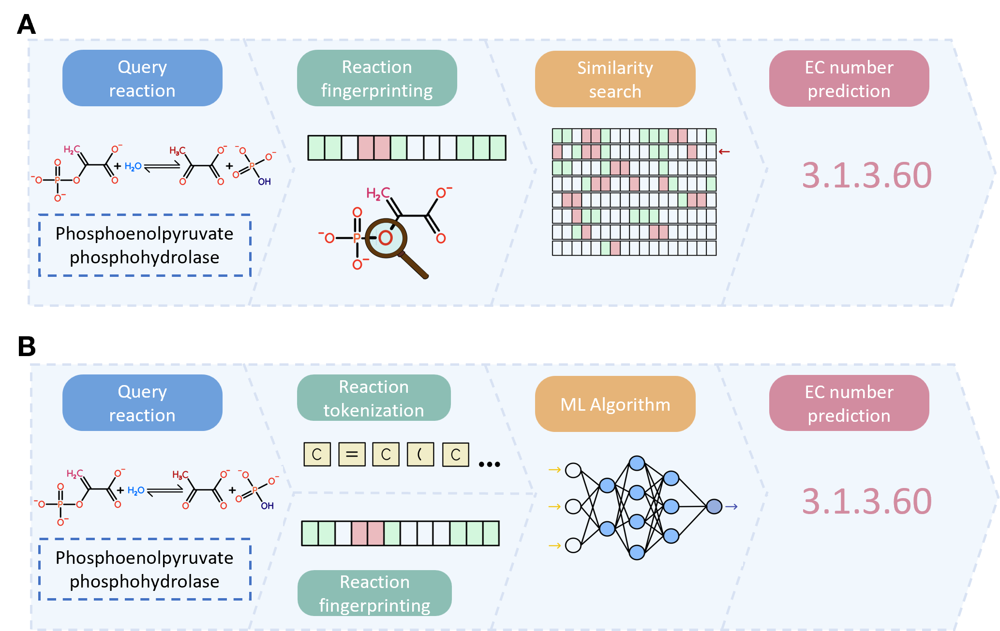

# EC Number Prediction Methods Review

This repository contains the code and data used to evaluate computational tools for enzyme function prediction. We benchmarked multiple EC number prediction algorithms — spanning both **similarity-based** and **machine/deep learning** approaches — using reaction SMILES as input. The pipeline includes scripts for dataset preprocessing, tool evaluation under various conditions, performance assessment across EC hierarchy levels and classes, and visualization of results. Overall, this repository provides a reproducible and extensible framework for benchmarking EC number prediction methods and helps users identify the most suitable tool for their metabolic modeling applications.

<p align="center">
  
  <br>
  <em>General pipeline of EC number prediction methodologies. A) Pipeline of similarity-based methods. B) Pipeline of machine/deep learning methods.</em>
</p>


Specifically, we assessed the tools under three conditions: 
1. We evaluated all selected methods — [E-zyme](https://www.genome.jp/tools/e-zyme/), [E-zyme2](https://www.genome.jp/tools/e-zyme2/), [BridgIT](https://lcsb-databases.epfl.ch/Bridgit), [SelenzymeRF](https://github.com/synbiochem/selenzyme/tree/SelenzymeRF), [SIMMER](https://github.com/aebustion/SIMMER), [Theia](.https://github.com/daenuprobst/theia), [BEC-Pred](https://github.com/KeeliaQWJ/BEC-Pred) and [CLAIRE](https://github.com/zishuozeng/CLAIRE) — Using 20% of the KEGG 2025 database (1866 reactions). 
2. For all of the methods with avaiable source code — [SelenzymeRF](https://github.com/synbiochem/selenzyme/tree/SelenzymeRF), [SIMMER](https://github.com/aebustion/SIMMER), [Theia](.https://github.com/daenuprobst/theia), [BEC-Pred](https://github.com/KeeliaQWJ/BEC-Pred) and [CLAIRE](https://github.com/zishuozeng/CLAIRE) — we trained or used as prior knowledge 80% of the MetaNetX database (34.046 reactions), and then queried the methods with the remaining 20% (3.783 reactions). 
3. We did a case study on 28 drugs and their associated enzyme-annotated degradation reactions, and used them to query against all selected methods. Additionally, we applied a Top1 and Top5 **majority voting strategy** using [SelenzymeRF](https://github.com/synbiochem/selenzyme/tree/SelenzymeRF), [SIMMER](https://github.com/aebustion/SIMMER), [Theia](.https://github.com/daenuprobst/theia) and [BEC-Pred](https://github.com/KeeliaQWJ/BEC-Pred), to show the potential of combining multiple algorithms to correctly predict EC number. 

For more information, please refer to:  

- Josefina Arcagni: jarcagniriv@unav.es 
- Telmo Blasco: tblasco@tecnun.es

## Cite

## Project Structure
The code has the following structure: 

```
ECNumberPrediction/
├── data/            # Input datasets for analysis
├── methods/         # Implemented EC number prediction methods
│   ├── BEC-Pred
│   ├── BridgIT
│   ├── CLAIRE
│   ├── E-zyme
│   ├── SelenzymeRF
│   ├── SIMMER
│   └── theia
├── results/         # Output results from the analyses
│   ├── Case1
│   ├── Case2
│   ├── CaseStudy
│   └── MajorityVote
└── README.md
```

### Notes:
- Put input files under `data/`.
- Each method in `methods/` has its own **bash file** with implementation steps.
- Outputs for runs and evaluations go to `results/<method_or_case>/`.
- Example workflow:
    1. Prepare inputs in `data/`.
    2. Run a method from `methods/<MethodName>.sh/`.
    3. Check results in `results/`.


## Installation

Clone the repository:

```bash
git clone https://github.com/yourusername/ECNumberPrediction.git
cd ECNumberPrediction
```
Each method in the `methods/` folder may have its own installation requirements. Refer to the individual method documentation for setup instructions.


### Included Tools

| **Tool**      | **Year** | **Type** | **Database**     | **Features**                                                                                          | **Open-source code** |
|----------------|----------|----------|------------------|--------------------------------------------------------------------------------------------------------|----------------------|
| **E-zyme**     | 2009     | SB       | KEGG             | RDM patterns, substrate-product pairs, Tanimoto score                                                  | [No](https://www.genome.jp/tools/e-zyme/)                   |
| **E-zyme2**    | 2016     | SB       | KEGG             | RDM patterns, substrate-product pairs, graph-based substructures                                       | [No](https://www.genome.jp/tools/e-zyme2/)                   |
| **BridgIT**    | 2019     | SB       | KEGG             | Daylight fingerprints, reactive site identification, BNICE.ch rules                                    | [No](https://lcsb-databases.epfl.ch/Bridgit)                   |
| **SelenzymeRF**| 2023     | SB       | MetaNetX         | Morgan fingerprints, RXNMapper reactive sites, fragment analysis                                       | [Yes (GitHub)](https://github.com/synbiochem/selenzyme/tree/SelenzymeRF)         |
| **SIMMER**     | 2023     | SB       | MetaCyc          | Atom-Pair fingerprints, Tanimoto score, enrichment analysis                                            | [Yes (GitHub)](https://github.com/aebustion/SIMMER)         |
| **Theia**      | 2023     | ML       | ECREACT / Rhea   | MLP, differential reaction fingerprints                                                                | [Yes (GitHub)](.https://github.com/daenuprobst/theia)         |
| **BEC-Pred**   | 2024     | ML       | USPTO-ECREACT    | BERT, transfer learning                                                                                | [Yes (GitHub)](https://github.com/KeeliaQWJ/BEC-Pred)         |
| **CLAIRE**     | 2025     | ML       | ECREACT          | Contrastive learning, rxnfp embeddings, differential reaction fingerprints                             | [Yes (GitHub)](https://github.com/zishuozeng/CLAIRE)         |


### Results

Results are organized in subfolders inside `results/`:

- `results/Case1/` – Results for the first evaluation case (queried all methods with their original dataset tested with KEGG reaction queries).

- `results/Case2/` – Results for the second evaluation case (five open-code methods trained on 80% of MetaNetX dataset and queried on the other 20%).

- `results/CaseStudy/` – Results for the Case Study (queries all methods with their original dataset with 28).

- `results/MajorityVote/` – Top1 and Top5 majority voting strategies using [SelenzymeRF](https://github.com/synbiochem/selenzyme/tree/SelenzymeRF), [SIMMER](https://github.com/aebustion/SIMMER), [Theia](.https://github.com/daenuprobst/theia) and [BEC-Pred](https://github.com/KeeliaQWJ/BEC-Pred). 
