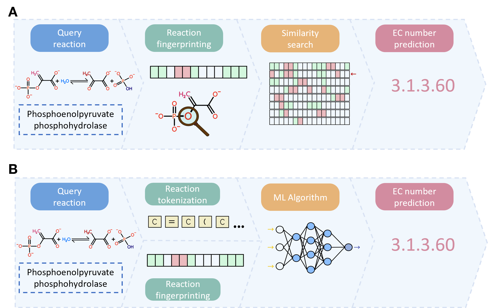

# EC Number Prediction

**v1.0.0** · [MIT License](LICENSE) · Josefina Arcagni, Telmo Blasco (University of Navarra)

This repository contains the code and data used to evaluate computational tools for enzyme function prediction. We benchmarked multiple EC (Enzyme Commission) number prediction algorithms — spanning both **similarity-based** and **machine/deep learning** approaches — using reaction SMILES as input. The pipeline includes scripts for dataset preprocessing, tool evaluation under various conditions, performance assessment across EC hierarchy levels and classes, and visualization of results. Overall, this repository provides a reproducible and extensible framework for benchmarking EC number prediction methods and helps users identify the most suitable tool for their metabolic modeling applications.

<p align="center">
  
  <br>
  <em>General pipeline of EC number prediction methodologies. A) Similarity-based methods. B) Machine/deep learning methods.</em>
</p>


Specifically, we assessed the tools under three conditions: 
1. We evaluated all selected methods — [E-zyme](https://www.genome.jp/tools/e-zyme/), [E-zyme2](https://www.genome.jp/tools/e-zyme2/), [BridgIT](https://lcsb-databases.epfl.ch/Bridgit), [SelenzymeRF](https://github.com/synbiochem/selenzyme/tree/SelenzymeRF), [SIMMER](https://github.com/aebustion/SIMMER), [Theia](https://github.com/daenuprobst/theia), [BEC-Pred](https://github.com/KeeliaQWJ/BEC-Pred) and [CLAIRE](https://github.com/zishuozeng/CLAIRE) — using 20% of the KEGG 2025 database (1866 reactions). To check robustness to which reactions get sampled, this KEGG evaluation was additionally re-run on **10 independently resampled draws of 500 reactions each** ("seeds" 0–9). We also evaluated these using a subset of 500 Rhea 2025 reactions.
2. For all of the methods with available source code — [SelenzymeRF](https://github.com/synbiochem/selenzyme/tree/SelenzymeRF), [SIMMER](https://github.com/aebustion/SIMMER), [Theia](https://github.com/daenuprobst/theia), [BEC-Pred](https://github.com/KeeliaQWJ/BEC-Pred) and [CLAIRE](https://github.com/zishuozeng/CLAIRE) — we evaluated them using three different data splits of the Rhea 2025 dataset: Stratified random split, Time-based split and Scaffold-aware split. The **Stratified** and **Scaffold** splits were each re-run across **3 random seeds** to check sensitivity to the particular train/test partition drawn; the **Time** split is a single deterministic chronological split. We trained the models with the training dataset and tested with the test set for each split. Additionally, we trained or used as prior knowledge 90% of the MetaNetX/KEGG/ECREACT/Rhea databases, and then queried the methods with the remaining 10%. All mentioned splits are included in `data`.
3. We did a case study on 28 drugs and their associated enzyme-annotated degradation reactions, and used them to query against all selected methods. Additionally, we applied a Top1 and Top5 **majority voting strategy** using [SelenzymeRF](https://github.com/synbiochem/selenzyme/tree/SelenzymeRF), [SIMMER](https://github.com/aebustion/SIMMER), [Theia](https://github.com/daenuprobst/theia) and [BEC-Pred](https://github.com/KeeliaQWJ/BEC-Pred), to show the potential of combining multiple algorithms to correctly predict EC number. 

### Table of Contents: 
- [Cite](#cite)
- [License](#license)
- [Project Structure](#project-structure)
- [Installation](#installation)
- [Included Tools](#included-tools)
- [Database Composition](#database-composition)
  - [Data Splitting](#data-splitting)
  - [SMILES Processing](#smiles-processing)
  - [E-zyme / E-zyme2](#e-zyme--e-zyme2)
  - [BridgIT](#bridgit)
  - [SelenzymeRF](#selenzymerf)
  - [SIMMER](#simmer)
  - [Theia](#theia)
  - [BEC-Pred](#bec-pred)
  - [CLAIRE](#claire)
- [Results](#results)
  - [Case 1](#case-1)
  - [Case 2](#case-2)
  - [CaseStudy](#casestudy)
  - [MajorityVote](#majorityvote)

For more information, please refer to:  

- Josefina Arcagni: jarcagniriv@unav.es 
- Telmo Blasco: tblasco@tecnun.es
  
## Cite

If you use this repository, please cite it — see [`CITATION.cff`](CITATION.cff) for citation metadata (BibTeX/APA export available via GitHub's "Cite this repository" button).

## License

[MIT](LICENSE)

## Project Structure
The code has the following structure: 

```
ECNumberPrediction/
├── data/            # Input datasets for analysis
├── methods/         # Implemented EC number prediction methods
│   ├── BEC-Pred
│   ├── BridgIT
│   ├── CLAIRE
│   ├── E-zyme
│   ├── SelenzymeRF
│   ├── SIMMER
│   └── theia
├── results/         # Output results from the analyses
│   ├── Case1
│   ├── Case2
│   ├── CaseStudy
│   └── MajorityVote
├── CITATION.cff
├── LICENSE
└── README.md
```

### Notes:
- Put input files under `data/`.
- Each method in `methods/` has its own **bash file** with implementation steps.
- Outputs for runs and evaluations go to `results/<method_or_case>/`.
- Example workflow:
    1. Prepare inputs in `data/`.
    2. Run a method from `methods/run_<MethodName>.sh/`.
    3. Check results in `results/`.


## Installation

Clone the repository:

```bash
git clone https://github.com/PlanesLab/ECNumberPrediction.git
cd ECNumberPrediction
```
Each method in the `methods/` folder may have its own installation requirements. Refer to the individual method documentation for setup instructions.


## Included Tools


| **Tool**      | **Year** | **Type** | **Database**     | **Features**                                                                                          | **Open-source code** |
|----------------|----------|----------|------------------|--------------------------------------------------------------------------------------------------------|----------------------|
| **E-zyme**     | 2009     | SB       | KEGG             | RDM patterns, substrate-product pairs, Tanimoto score                                                  | [No](https://www.genome.jp/tools/e-zyme/)                   |
| **E-zyme2**    | 2016     | SB       | KEGG             | RDM patterns, substrate-product pairs, graph-based substructures                                       | [No](https://www.genome.jp/tools/e-zyme2/)                   |
| **BridgIT**    | 2019     | SB       | KEGG             | Daylight fingerprints, reactive site identification, BNICE.ch rules                                    | [No](https://lcsb-databases.epfl.ch/Bridgit)                   |
| **SelenzymeRF**| 2023     | SB       | MetaNetX         | Morgan fingerprints, RXNMapper reactive sites, fragment analysis                                       | [Yes (GitHub)](https://github.com/synbiochem/selenzyme/tree/SelenzymeRF)         |
| **SIMMER**     | 2023     | SB       | MetaCyc          | Atom-Pair fingerprints, Tanimoto score, enrichment analysis                                            | [Yes (GitHub)](https://github.com/aebustion/SIMMER)         |
| **Theia**      | 2023     | ML       | ECREACT / Rhea   | MLP, differential reaction fingerprints                                     | [Yes (GitHub)](https://github.com/daenuprobst/theia)         |
| **BEC-Pred**   | 2024     | ML       | USPTO-ECREACT    | BERT, transfer learning                                                                                | [Yes (GitHub)](https://github.com/KeeliaQWJ/BEC-Pred)         |
| **CLAIRE**     | 2025     | ML       | ECREACT          | Contrastive learning, rxnfp embeddings, differential reaction fingerprints                             | [Yes (GitHub)](https://github.com/zishuozeng/CLAIRE)         |

*The table above summarizes the tools used, detailing their year of release, type (SB: similarity-based or ML: machine learning), associated databases, key features, and availability of open-source code.*

## Database Composition

| Database | Version | Reactions (EC-assigned) | 1. Oxidoreductases | 2. Transferases | 3. Hydrolases | 4. Lyases | 5. Isomerases | 6. Ligases | 7. Translocases |
|:---|:---|---:|---:|---:|---:|---:|---:|---:|---:|
| **MetaNetX** | MNXref 4.5 (2025-08) | 37,829 | 15,183 | 11,144 | 7,057 | 2,106 | 786 | 1,438 | 115 |
| **ECREACT** | 1.0 | 56,279 | 13,198 | 31,954 | 5,005 | 3,512 | 1,141 | 1,263 | 206 |
| **KEGG** | 2025 release | 7,780 | 2,641 | 2,495 | 1,148 | 833 | 337 | 310 | 16 |
| **Rhea** | 2025 snapshot (Expasy `ftp.expasy.org/databases/rhea/tsv/`, downloaded 2026-08-14) | 7,316 | 2,532 | 2,301 | 967 | 834 | 337 | 267 | 78 |
| **MetaCyc** | not recorded (bundled with SIMMER's upstream reference DB, `methods/SIMMER/SIMMER_code/SIMMER/SIMMER_files/chem_data/`) | 6,444 | 2,213 | 1,830 | 931 | 864 | 505 | 99 | 2 |

### Data Splitting

Three ways to split reaction data into train/test, used to build the Rhea splits for [Case 2](#case-2) (`data/Splits-Rhea/scripts/`, run against `data/Splits-Rhea/master.tsv`):

- **Stratified** — random split, balanced by EC subsubclass.
- **Scaffold** — split by Bemis-Murcko scaffold within each EC subsubclass, so structurally similar reactions don't leak across train/test.
- **Time** — trains on an older database snapshot, tests on reactions new to the current one.

```bash
python3 data/Splits-Rhea/scripts/stratified_split.py \
  --input data/Splits-Rhea/master.tsv --output_dir data/Splits-Rhea/Stratified --seed 42

python3 data/Splits-Rhea/scripts/scaffold_split.py \
  --input data/Splits-Rhea/master.tsv --output_dir data/Splits-Rhea/Scaffold --seed 42

python3 data/Splits-Rhea/scripts/time_split.py \
  --old_db data/Splits-Rhea/old_ids_reconstructed.tsv \
  --new_db data/Splits-Rhea/master.tsv \
  --output_dir data/Splits-Rhea/Time
```


Each writes `train.tsv`/`test.tsv` to `--output_dir`. All three keep every EC row of a multi-EC reaction on the same side of the split. `--seed` (default 42) is what varies across the `seed_splits/seed{0,1,2}/` reruns used for the [Rhea Splits Comparison](#case-2).

### SMILES Processing

Canonicalizes reaction SMILES using RDKit. Accepts a plain text file (one
SMILES per line), a CSV/TSV file with a specified SMILES column, or an entire
directory of such files.

Find in `data/Preprocessing/canonicalize_rxn_SMILES.py`

Each reaction SMILES is expected in the format:
```text
reactant1.reactant2>>product1.product2
```

Atom mapping is not assumed. Reactants and products are each sorted
alphabetically after canonicalization to ensure a deterministic output
regardless of input order. Invalid molecules are filtered out; invalid
reactions are skipped with a warning.

### Usage

**Plain text file (one SMILES per line):**
```bash
python3 canonicalize_smiles.py \
  --input  data/reaction_smiles.txt \
  --output data/reaction_smiles_can.txt
```

**CSV file with a named SMILES column:**
```bash
python3 canonicalize_smiles.py \
  --input      data/reactions.csv \
  --output     data/reactions_can.csv \
  --smiles_col rxn_smiles
```

**TSV file, custom output column name:**
```bash
python3 canonicalize_smiles.py \
  --input      data/reactions.tsv \
  --output     data/reactions_can.tsv \
  --smiles_col smiles \
  --output_col can_smiles
```


#### Arguments

| Argument | Default | Description |
|:---------|:--------|:------------|
| `--input` | — | Input file or directory (required) |
| `--output` | — | Output file or directory (required) |
| `--smiles_col` | — | Column name containing SMILES (required for CSV/TSV) |
| `--output_col` | `canonical_smiles` | Column name for the canonical SMILES output |
| `--sep` | auto | Delimiter for tabular files (auto-detected from `.csv`/`.tsv` extension) |
| `--keep_failed` | off | Keep rows where canonicalization failed (written as empty) |
| `--extension` | `.txt` | File extension filter when processing a directory |


####  Output

For plain text input, each valid reaction is written as a canonical SMILES
string on its own line.

For CSV/TSV input, all original columns are preserved and a new column
(default: `canonical_smiles`) is appended with the canonicalized result.
Rows that fail canonicalization are dropped unless `--keep_failed` is set.

A summary of canonicalized vs. failed reactions is printed per file.

---


## Follow the steps below for implementing each of the tools included in the `methods/` folder:

Every runner script below (`methods/<Tool>/run_<tool>.sh`) processes the configured cases (Case 1, Case 2, and/or CaseStudy, as applicable per tool) and writes its output CSV to `results/<case>/<Tool>.csv`. This is the same for all tools and is not repeated per tool below — see [Results](#results) for how those outputs are merged and scored.

### E-zyme / E-zyme2

1. Create & activate venv:
```bash
python3 -m venv e-zyme_venv
source e-zyme_venv/bin/activate 
```

2. Install libs:
```bash
python -m pip install --upgrade pip
pip install requests beautifulsoup4 pandas
```

3. Make runner executable and run:
```bash
chmod +x methods/E-zyme/run_ezyme.sh
bash methods/E-zyme/run_ezyme.sh
```

Runs Case 1 and Case Study; E-zyme and E-zyme2 both output as `E-zyme.csv`.

### BridgIT

1. Create & activate venv:
```bash
python3 -m venv bridgit_venv
source bridgit_venv/bin/activate 
```
2. Install libs:
```bash
python -m pip install --upgrade pip
pip install requests pandas rdkit
```

3. Make runner executable and run:
```bash
chmod +x methods/BridgIT/run_BridgIT.sh
bash methods/BridgIT/run_BridgIT.sh
```

*Notes:* BridgIT can only be accessed through its own server in https://lcsb-databases.epfl.ch/Bridgit, a user account needs to be created to access it. The first part of the bash file will process reaction SMILES and create the necessary files in `methods/BridgIT/input/` to input in their web server. Once the results are ready, download them from the server and place them in the `methods/BridgIT/output/` folder. The steps for extracting the results are in the second part of the bash file. Runs Case 1 and Case Study.

### SelenzymeRF

1. Create & activate venv:
```bash
python3 -m venv selenzyme_venv
source selenzyme_venv/bin/activate 
```

2. Install libs:
```bash
python -m pip install --upgrade pip
pip install requests beautifulsoup4 pandas
```

3. Clone repository & download data:
```bash
git clone -b SelenzymeRF https://github.com/synbiochem/selenzyme.git methods/SelenzymeRF/SelenzymeRF_code
cd methods/SelenzymeRF/SelenzymeRF_code
```
*Notes:* unzip the required reference datasets as indicated in the upstream repository. The script already included in `Selenzyme_code/`: `/methods/SelenzymeRF/SelenzymeRF_code/start_server.sh` was specifically modified to run the cases and shouldn't be deleted. 


4. Make runner executable and run:
```bash
chmod +x /methods/SelenzymeRF/run_selenzymerf.sh
bash /methods/SelenzymeRF/run_selenzymerf.sh
```

Runs all cases; output as `SelenzymeRF.csv`.

### SIMMER

1. Create conda environment:
```bash
conda env create -f methods/SIMMER/simmer_env.yml
conda activate simmer_env
```

2. Clone repository & download data:
```bash
git clone https://github.com/aebustion/SIMMER.git methods/SIMMER/SIMMER_code
cd methods/SIMMER/SIMMER_code
```

*Notes:* import the required reference datasets as indicated in the upstream repository. The scripts already included in `SIMMER_code/`: `methods/SIMMER/SIMMER_code/SIMMER/SIMMER.py` and `methods/SIMMER/SIMMER_code/SIMMER/SIMMER2.py` were specifically modified to run the cases and shouldn't be deleted. 

3. Make runner executable and run:
```bash
chmod +x methods/SIMMER/run_SIMMER.sh
bash methods/SIMMER/run_SIMMER.sh
```

Runs all cases; output as `SIMMER.csv`.

### Theia 

*Requirements*: 1 GPU and 50G memory for training and evaluating the model.

1. Create conda environment:
```bash
conda env create -f methods/theia/theia_env.yml
conda activate theia_env
```

2. Clone repository & download data:
```bash
git clone https://github.com/daenuprobst/theia.git methods/theia/theia_code
cd methods/theia/theia_code
```

*Notes:*  All the scripts already included in `Theia_code/`  were specifically modified to run the cases and shouldn't be deleted. 


3. Make runner executable and run:
```bash
chmod +x methods/theia/run_theia.sh
bash methods/theia/run_theia.sh
```

Runs all cases; output as `theia.csv`.

### BEC-Pred 

*Requirements*: 1 GPU and 128G memory for training and evaluating the model.

1. Create conda environment:
```bash
conda env create -f methods/BEC-Pred/becpred_gpu.yml
conda activate becpred_env
```


2. Make runner executable and run:
```bash
chmod +x methods/BEC-Pred/run_becpred.sh
bash methods/BEC-Pred/run_becpred.sh
```

Runs all cases; output as `BEC-Pred.csv`.

### CLAIRE

*Requirements:* 1 GPU and 128G memory for training and evaluating the model.

1. Create conda environments:
```bash
conda env create -f methods/CLAIRE/claire_env.yml
# activate when using CLAIRE tools
conda activate claire_env

conda env create -f methods/CLAIRE/rxnfp_env.yml
# activate when using rxnfp utilities
conda activate rxnfp_env
```

2. Clone repository & download data:
```bash
git clone https://github.com/zishuozeng/CLAIRE.git methods/CLAIRE/CLAIRE_code
cd methods/CLAIRE/CLAIRE_code
```
Notes: Import or unzip any reference datasets required by CLAIRE as indicated in the upstream repository. Do not remove or modify the modified scripts included in `methods/CLAIRE/CLAIRE_code/` that are needed to run the cases.

3. Make runner executable and run:
```bash
chmod +x methods/CLAIRE/run_claire.sh
bash methods/CLAIRE/run_claire.sh
```

Runs the configured cases; output as `CLAIRE.csv`.

## Results

Results are organized in subfolders inside `results/`:

- `results/Case1/` – Results for the first evaluation case (queried all methods with their original dataset tested with KEGG reaction queries).

- `results/Case2/` – Results for the second evaluation case (five open-source methods trained and tested on different datasets and data splits).

- `results/CaseStudy/` – Results for the Case Study (queries all methods with their original dataset using 28 drug-associated reactions).

- `results/MajorityVote/` – Top1 and Top5 majority voting strategies using [SelenzymeRF](https://github.com/synbiochem/selenzyme/tree/SelenzymeRF), [SIMMER](https://github.com/aebustion/SIMMER), [Theia](https://github.com/daenuprobst/theia) and [BEC-Pred](https://github.com/KeeliaQWJ/BEC-Pred). 


- `results/Case1/kegg500_bootstrap_analysis/` – per-seed metrics and figures for the per-seed KEGG-500 bootstrap re-run (10 fresh 500-reaction samples, all 8 methods), including a precomputed pairwise significance comparison. See [KEGG-500 Bootstrap Analysis & Statistical Significance](#kegg-500-bootstrap-analysis--statistical-significance).
- `results/Case1/kegg500_bootstrap_full_coverage/` – the same 10 seeds re-scored on a "full coverage" subset (only reactions where all 8 methods returned a prediction), so Coverage differences can't drive the MCC/Precision/Recall comparison.
- `results/Case2/results-splits/` – per-seed, per-split raw predictions and aggregated metrics for the Rhea Stratified/Time/Scaffold split comparison. See [Rhea Splits Comparison](#rhea-splits-comparison).
- `results/Case2/OxidoreductaseStudy/` – the cofactor-stripping (no-cofactor) study for SIMMER and BEC-Pred. See [Cofactor-Stripping Study](#cofactor-stripping-study).

To reproduce the metrics and figures used in the paper for each case, follow the steps below:

### Case 1

1. Merge all tool CSV outputs:
```bash
python3 results/Case1/join_results.py \
  --predictions_dir results/Case1/KEGG-1.8K \
  --ground_truth_csv data/Subsets/KEGG/kegg_reactions_current_test.csv \
  --output results/Case1/merged_output.csv
```

2. Compute evaluation metrics:
```bash
python3 results/Case1/get_metrics.py
```
Output: `results/Case1/evaluation_summary.csv`

3. Generate plots:
```bash
Rscript results/Case1/metrics-case1.R
```

4. Bootstrap-resample the same split for confidence estimates (10 resamples with replacement):
```bash
python3 results/Case1/bootstrap_metrics.py
```
Output: `results/Case1/bootstrap_metrics.csv` (per-seed, per-method) and `results/Case1/bootstrap_summary.csv` (mean ± std across seeds).

#### KEGG-500 Bootstrap Analysis & Statistical Significance

A sturdier check than step 4: Case 1 re-run on **10 freshly-resampled 500-reaction draws** ("seeds" 0–9) instead of one fixed split, all 8 methods.

- `results/Case1/kegg500_bootstrap/` – per-seed merged predictions.
- `results/Case1/kegg500_bootstrap_full_coverage/` – same seeds, restricted to reactions all 8 methods answered (isolates accuracy from coverage differences).
- `results/Case1/kegg500_bootstrap_analysis/` – per-seed metrics and a pairwise MCC significance comparison (`case1_mcc_method_x_seed_withPVALS.csv`), plus the figures (Panel A: Coverage/Precision/Recall/MCC per method; Panel B: per-class breakdown; Panel C: Top-1 vs Top-5):
```bash
Rscript results/Case1/kegg500_bootstrap_analysis/full_figure_kegg500_bootstrap.R
Rscript results/Case1/kegg500_bootstrap_analysis/full_figure_kegg500_bootstrap_full_coverage.R
```

### Case 2

1. Merge all tool CSV outputs (`--methods` picks out just the prediction files, since `results-metanetx/` also holds derived outputs):
```bash
python3 results/Case2/join_results.py \
  --predictions_dir results/Case2/results-metanetx \
  --methods BEC-Pred CLAIRE SelenzymeRF SIMMER Theia \
  --ground_truth_csv data/Splits-DBs/MetaNetX/test.tsv \
  --output results/Case2/merged_output.csv
```

2. Compute evaluation metrics:
```bash
python3 results/Case2/get_metrics.py
```
Output: `results/Case2/evaluation_summary.csv`

3. Generate plots:
```bash
Rscript results/Case2/results-metanetx/metrics-case2.R
```
Output: `results/Case2/case2_plot.png`

#### Rhea Splits Comparison

The 5 open-source methods (SelenzymeRF, SIMMER, Theia, BEC-Pred, CLAIRE) were also compared across three ways of splitting Rhea 2025 into train/test (`data/Splits-Rhea/{Stratified,Time,Scaffold}/`): **Stratified** (random), **Time-based** (train on older reactions, test on newer) and **Scaffold-aware** (test reactions structurally unlike train). Stratified and Scaffold were each re-run across **3 seeds** to check sensitivity to the partition drawn; Time is a single deterministic split.

- `results/Case2/results-splits/seed_runs/` – per-method predictions, ground truth, and merged outputs for each split/seed.
- `results/Case2/results-splits/seed_summary.py` → `seed_summary.csv` – aggregated per-split, per-method metrics (mean ± std across seeds).

#### Cofactor-Stripping Study

Does stripping generic metabolic cofactors (NAD(H), NADP(H), FAD, etc. via `methods/SIMMER/SIMMER_scripts/strip_cofactors.py`) help or hurt EC prediction? **SIMMER** and **BEC-Pred** were each run on the Rhea Stratified split with and without cofactors:
```bash
bash methods/SIMMER/run_SIMMER_rhea_nocofactor.sh
bash methods/BEC-Pred/run_BECPred_rhea_stratified_nocofactor.sh
```
**Finding:** stripping cofactors *helps* SIMMER (class 1 MCC 0.69→0.79) but *hurts* BEC-Pred (0.86→0.80) — the two methods lean on cofactor presence in opposite directions. Full write-up in `results/Case2/OxidoreductaseStudy/README.md`.

### CaseStudy
1. Merge all tool CSV outputs into merged_output_case3.csv:
```bash
python3 results/CaseStudy/join_results.py
```
Output: `results/CaseStudy/merged_output_case3.csv`

2. Generate plots:
```bash
Rscript results/CaseStudy/case_study_heatmap.R
```
Output: `results/CaseStudy/casestudyplot_final.jpg` (two panels — see below) and `results/CaseStudy/majority_vote_results_final.csv`. Requires R ≥ 4.4 with `ggplot2`, `dplyr`, `tidyr`, `readr`, `stringr`, `cowplot`, `RColorBrewer`, `tibble`, `purrr`, `readxl`.

**Panel A** is a per-drug heatmap: rows are the 28 drugs (ordered by true EC), columns are the 8 methods plus **MV-1**/**MV-5** — a Top-1/Top-5 majority vote across SelenzymeRF, SIMMER, Theia and BEC-Pred, computed inline in this script — colored by hit type (`Top 1` / `Top 5` / `No hit` / `No prediction`), with a left-hand color strip grouping drugs by EC subsubclass. **Panel B** is a stacked bar chart of each method's (+ MV-1/MV-5's) Top-1 hit count, broken down by true EC class.


### MajorityVote 


A standalone, general-purpose CLI tool (`results/MajorityVote/majority_vote.py`) that combines multiple EC number prediction outputs using a **points-weighted** majority vote across an arbitrary set of methods and an arbitrary top-N window.

#### How It Works

Each method's predictions are parsed into ranked groups. All ECs in the same group receive equal points based on their rank position:

- Rank 1 → `top_n` pts
- Rank 2 → `top_n - 1` pts
- ...
- Rank N → 1 pt

Points are summed across all methods to produce a total weighted score per EC. Co-predictions (pipe-separated ECs at the same rank) receive equal points and are not penalised.

Tie-breaking (all descending): total weighted score → count at rank 1 → count at rank 2 → ... → if still tied, pipe-joined into one shared slot (e.g. `1.2.3|4.5.6`).

ECs are automatically collapsed to the 3rd hierarchical level (e.g. `1.2.3.4` → `1.2.3`).

#### Input

A CSV file with an identifier column (default: `entity`) and one or more method columns containing EC predictions in this format:
```text
1.1.1.1|1.1.1.2;2.7.1.1|2.7.1.2
```

- `;` separates rank slots (rank 1 → rank 2 → ...)
- `|` separates tied ECs within the same rank slot

#### Usage

**All entities:**
```bash
python3 majority_vote.py \
  --input_csv results/merged_predictions.csv \
  --entity all \
  --use_all \
  --output_csv results/majority_votes.csv
```

**Single entity:**
```bash
python3 majority_vote.py \
  --input_csv results/merged_predictions.csv \
  --entity R001 \
  --methods MethodA MethodB MethodC
```

**Custom identifier column or top-N window:**
```bash
python3 majority_vote.py \
  --input_csv results/merged_predictions.csv \
  --entity all \
  --use_all \
  --id_col reaction_id \
  --top_n 3
```

#### Arguments

| Argument | Default | Description |
|:---------|:--------|:------------|
| `--input_csv` | — | Path to merged prediction CSV (required) |
| `--entity` | — | Entity ID to query, or `all` (required) |
| `--methods` | — | Specific method columns to use |
| `--use_all` | — | Use all EC prediction columns |
| `--top_n` | `5` | Scoring window and output length |
| `--id_col` | `entity` | Name of the identifier column |
| `--output_csv` | — | Optional path to save results CSV |

Either `--methods` or `--use_all` must be provided.


#### Output

| Column | Description |
|:-------|:------------|
| `majority_top1` | Top-ranked consensus EC (or `A\|B` if unbreakable tie) |
| `majority_topN_ranked` | Full ranked list of up to N slots, separated by ` ; ` |
